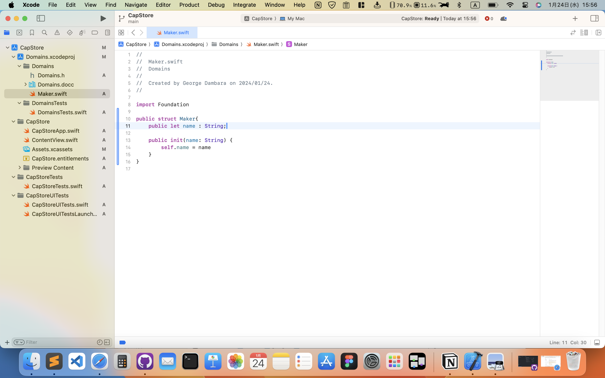

# cap-store-app

電子部品管理アプリ

## プロジェクト作成

目的は、UI用のプロジェクトと、ロジックのみのプロジェクトを分離し、
UIプロジェクトからロジックプロジェクトを呼び出せるようにすること。

### 環境

- macOS Sonoma14.3
- Xcode 15.2

### UIプロジェクト作成


Xcodeを開き、`Create New Project`を押す


タブは`macOS`を選択し、グループ`Application`の`App`を選択して`Next`ボタンを押す


`ProductName`にアプリ名を入力し、`Next`ボタンを押す


フォルダ作成先ダイアログが表示されるので作成先を選んで`Create`ボタンを押す


UI用プロジェクトが立ち上がる

### ロジックプロジェクト作成


`File`の`New`の`Project...`をクリックする


タブは`macOS`を選択し、グループの`Framework & Library`の`Framework`を選択して`Next`ボタンを押す


`Product Name`にロジック用プロジェクト名を入力し、`Next`ボタンを押す


フォルダ作成先ダイアログが表示される。デフォルトでは`Add to:`が`Don't add to any project or workspace`になっているので変更する


`Add to:`をUI用プロジェクトに変更すると`Group:`も一緒に変更される


するとUI用プロジェクトにロジック用プロジェクトがサブプロジェクトとして追加されたのが左のツリーメニューからわかる

### ロジック用プロジェクトにプログラム追加


ロジック用プロジェクトのフォルダを右クリックして`New File...`を押す


タブの`macOS`のグループ`Source`の`Swift File`を選択し`Next`ボタンを押す


プログラム名を入力する。`Targets`はデフォルトのままで良い



試しに以下のプログラムを追加した

```swift:Maker.swift
import Foundation

public struct Maker{
    public let name : String;
    
    public init(name: String) {
        self.name = name
    }
}
```

### UIプロジェクトからロジックプロジェクトのプログラムをテスト


UIプロジェクトの`CapStoreTest.swift`からDomainsプロジェクトのMakerをテストする
UIプロジェクトを選択し`Generals`の`TARGETS`の`CapStoreTests`を選択し、画面下部の`Frameworks and Libraries`の`+`ボタンを押す


ロジック用プロジェクトの`Domains.framework`を選択し、`Add`ボタンを押す


`Frameworks and Libraries`に`Domains.framework`が追加された


UIプロジェクトのテストコードでロジックプロジェクトのMakerを使用したテストを行う

`import Domains`でロジック用プロジェクトをインポートしている

```swift:CapStoreTests.swift
import XCTest
import Domains

@testable import CapStore

final class CapStoreTests: XCTestCase {

    func testExample() throws {
        let name : String = "test";
        let maker = Maker(name: name);
        XCTAssertEqual(name, maker.name);
    }
}
```

### UIプロジェクトでロジックプロジェクトのプログラムを使用


この場合は`import Domains`と書くだけでロジック用プロジェクトのプログラムを使用できる

### フォルダ構成


フォルダ構成はこのようになっている

### ロジック用プロジェクト単体で実行


ロジック用プロジェクトの`.xcodeproj`ファイルを開く


ロジック用プロジェクト単体でビルド、テストが可能


ロジック用プロジェクトのテストコード
